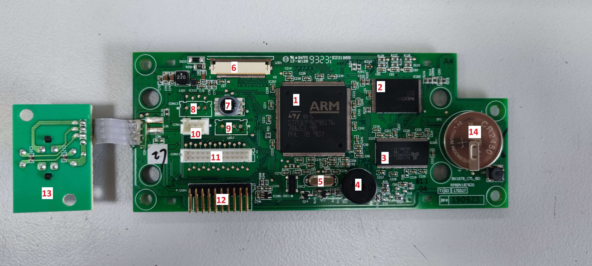

# Breville/Sage Barista Touch hacking

This repository contains my progress reverse engineering the Breville/Sage Barista Touch espresso machine.  
The target of this is to either find out how to control the machine or to find out how to replace the control board with a custom one.

## Control board

Starting with the main control board.  
This should give us a good overview of the hardware running this machine.  
The control board is behind the display so you need to remove the front panel to access it.

### Main PCB parts

The main PCB contains the following (major) parts on the front:
1. [STM32F429BIT6](https://www.st.com/en/microcontrollers-microprocessors/stm32f429bi.html) microcontroller
2. [MX29GL256FHT2I-90Q](https://www.digikey.com/en/products/detail/macronix/MX29GL256FHT2I-90Q/2744732) 256Mb NOR Flash
3. [AS4C8M32S-7TCN](https://www.alliancememory.com/datasheets/AS4C8M32S/) 256Mb SDRAM
4. TDK piezo buzzer. Something like [this](https://product.tdk.com/en/search/sw_piezo/sw_piezo/piezo-buzzer/info?part_no=PS1720P02)
5. Standart 8.0Mhz Oscillator
6. 40 pin FPC connector for the display
7. Mysterious 4 pin pressure sensor (see below)
8. 4 pin port without markings (see below)
9. 4 pin UART port (see below)
10. 3 pin connector for the grind-setting encoder
11. 40 pin connector going to the power board
12. 20 pin debug port. Probably used by the manufacturer to flash the firmware
13. Power button PCB with two white LEDs
14. Soldered CR2450 battery

And on the back:

1. [ST M93C66-W](https://www.st.com/en/memories/m93c66-w.html) Serial access EEPROM
2. [MAX4460](https://www.analog.com/en/products/max4460.html) Amplifier

### Display

The display is a 4.3" 480x272 TFT LCD with capacitive touch screen.  
The display is connected to the main PCB via a 40-pin FPC connector.  
It is labeled as `CTM480272T16-D` which can not be found on the internet.  
The closest I could find is the [Adafruit 4.3" 40-pin TFT Display](https://www.adafruit.com/product/1591).  
I confirmed the pinout **only** by checking that the three ground-pins on 3, 29 and 36 are actually connected to ground. Other display have ground on different pins so I'm pretty positive the layout is correct.

### UART port

On the PCB there is an UART port which is not soldered.  
Attaching cables and connecting it to my logic analyzer gave me - nothing. Bummer.  
The only thing visible is some random gibberish data on the RX line.  
Those data are also visible while the machine is **not** connected to mains - possibly because of the backup battery.

The same applies to the other port number 8

### Pressure sensor

There is a sensor on the PCB which was connected to a hose leasing to venturi valve.  
It is marked `FN9520` and googling this leads me to the [Amsys SM9520A](https://www.amsys-sensor.com/products/ceramic-and-silicon-pressure-measuring-cells/sm95g-low-pressure-sensor-die/) a low differential pressure sensor die.

## Power PCB

The power PCB is located at the back of the machine behind the power-supply.

It contains the following cables:

1. Third valve (right)
2. Single valve (bottom)
3. Pump
4. Bean hopper switch
5. Neutral
6. Grinder motor
7. Grinder motor
8. ??? Going into heatshrink. Probably phase
9. (The blue one below) Second valve (center)
10. First valve (left)
11. Thermojet
12. Goes to the TRIAC under the heatsink (see next paragraph)
13. Airpump
14. Watertank reed switch
15. Flowwheel
16. Thermojet NTC
17. Coming from PSU. Probably low voltage supply
18. Steamwand rised/lowered switch
19. Portafilter switch
20. 40 pin connector to main PCB
21. 6 pin milkpitcher switch and NTC

### Other parts on this PCB

- 

## The heatsink

On the left side there is a heatsink with 3 cables going in (red, purple and yellow).  
Under the heatsink there is a simple [Q6015L6](https://www.mouser.com/ProductDetail/Littelfuse/Q6015L6?qs=DBUMZ2Yty93GeYTH4lKOzw%3D%3D) 15 Amp TRIAC.  
This either controls the thermojet or supplies the whole system with power after the MCU wakes up.

## Now what?

We do have two options now:

1. Remove the PCB and add a different.
2. "Crack" the firmware and flash a custom one 

### Replacing the PCB

At first I thought this is the way to go.  
Unfortunately the display is not compatible with Raspberry Pis or other SBCs.  
Adafruit does have a [board](https://www.adafruit.com/product/1590) which should be compatible but it costs 40$ and I'm not sure if it is worth it.  
At that cost you could simply swap the whole display/pcb unit with an [ESP32 with display](https://aliexpress.com/item/1005006213165842.html)

### Customizing the firmware

The hardware we have is pretty powerful.  
We have a 32bit ARM Cortex M4 with up to 180Mhz, 256Mb RAM and 256Mb flash.  
You ever thought you could say that about your coffee machine? 