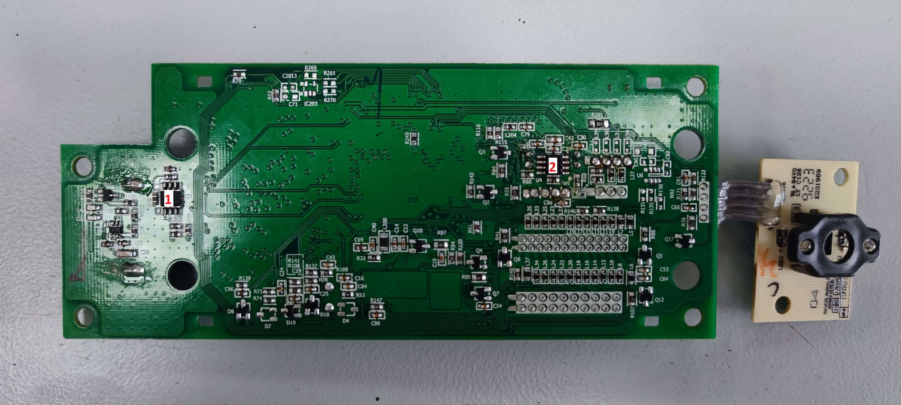
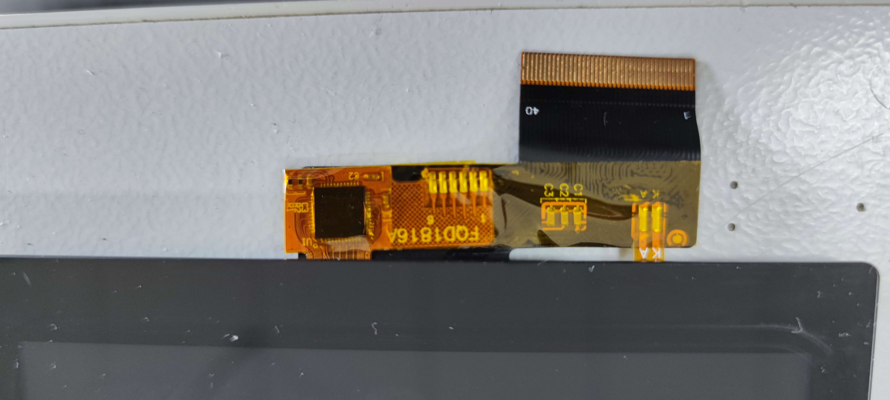
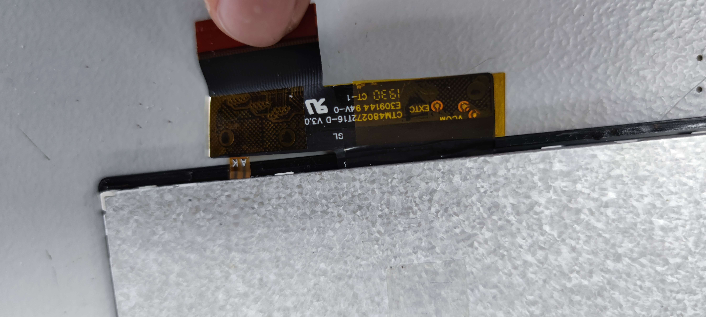
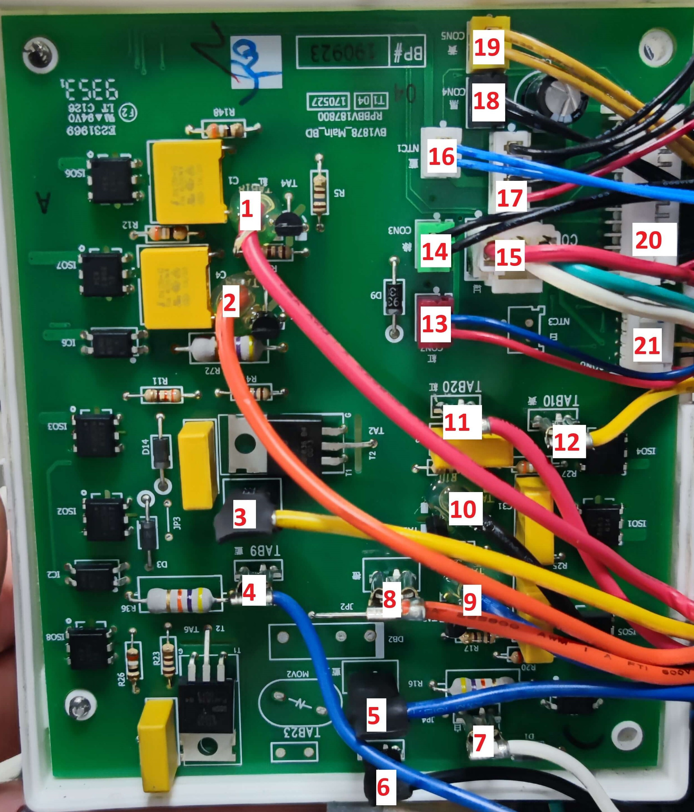

# Breville/Sage Barista Touch hacking

This repository contains my progress reverse engineering the Breville/Sage Barista Touch espresso machine.  
The target of this is to either find out how to control the machine or to find out how to replace the control board with a custom one.

## Why?

Because I replaced my machine by a proper dual boiler.  
I bought this machine defective for as less as 50 Euro and thought I won't resell it and tinker around with it instead.  
Also, this machine has a few faults which could be overcome with a different firmware or controller.  
Some of those are:
- Better temperature controlling
- Better temperature options (Degrees instead of low, medium and high)
- More drink customization options
- WiFi/Bluetooth connection (to control the machine from a phone, connect with a scale etc)
- Better grind timings (Currently only seconds possible)

**And most importantly: because its fun**

## Control board

Starting with the main control board.  
This should give us a good overview of the hardware running this machine.  
The control board is behind the display so you need to remove the front panel to access it.

### Control PCB parts

The control PCB contains the following (major) parts on the front:

| **Number** | **Part**                                                                                                                         |
|------------|----------------------------------------------------------------------------------------------------------------------------------|
| 1          | [STM32F429BIT6](https://www.st.com/en/microcontrollers-microprocessors/stm32f429bi.html) microcontroller                         |
| 2          | [MX29GL256FHT2I-90Q](https://www.digikey.com/en/products/detail/macronix/MX29GL256FHT2I-90Q/2744732) 256Mb NOR Flash             |
| 3          | [AS4C8M32S-7TCN](https://www.alliancememory.com/datasheets/AS4C8M32S/) 256Mb SDRAM                                               |
| 4          | TDK piezo buzzer. Something like [this](https://product.tdk.com/en/search/sw_piezo/sw_piezo/piezo-buzzer/info?part_no=PS1720P02) |
| 5          | Standart 8.0Mhz Oscillator                                                                                                       |
| 6          | 40 pin FPC connector for the display                                                                                             |
| 7          | Mysterious 4 pin pressure sensor (see below)                                                                                     |
| 8          | 4 pin port without markings (see below)                                                                                          |
| 9          | 4 pin UART port (see below)                                                                                                      |
| 10         | 3 pin connector for the grind-setting encoder                                                                                    |
| 11         | 26 pin connector going to the power board                                                                                        |
| 12         | 20 pin debug port. Probably used by the manufacturer to flash the firmware                                                       |
| 13         | Power button PCB with two white LEDs                                                                                             |
| 14         | Soldered CR2450 battery. Connected to VBat of the STM32                                                                          |

And on the back:

| **Number** | **Part**                                                                                                                         |
|------------|----------------------------------------------------------------------------------------------------------------------------------|
| 1          | [ST M93C66-W](https://www.st.com/en/memories/m93c66-w.html) Serial access EEPROM                                                 |
| 2          | [MAX4460](https://www.analog.com/en/products/max4460.html) Amplifier                                                             |

### Display

The display is a 4.3" 480x272 TFT LCD with capacitive touch screen controlled by a [Sitronix ST16331](https://www.sitronix.com.tw/en/products/projected-c-touch-controller-ic/).  
The display is connected to the main PCB via a 40-pin FPC connector.  
It is labeled as `CTM480272T16-D` which can not be found on the internet.  
The closest I could find is the [Adafruit 4.3" 40-pin TFT Display](https://www.adafruit.com/product/1591).  
I confirmed the pinout **only** by checking that the three ground-pins on 3, 29 and 36 are actually connected to ground. Other display have ground on different pins so I'm pretty positive the layout is correct.

### UART port

On the PCB there is an UART port which is not soldered.  
Attaching cables and connecting it to my logic analyzer gave me - nothing. Bummer.  
The only thing visible is some random gibberish data on the RX line.  
Those data are also visible while the machine is **not** connected to mains - possibly because of the backup battery.

The same applies to the other port number 8

**This needs more investigation.** we should be able to get something out of it

### Pressure sensor

There is a sensor on the PCB which was connected to a hose leading to the venturi valve.  
It is labeled `F9520` and googling this leads me to the [Amsys SM9520A](https://www.amsys-sensor.com/products/ceramic-and-silicon-pressure-measuring-cells/sm95g-low-pressure-sensor-die/) a low differential pressure sensor die.

## Power PCB

The power PCB is located at the back of the machine behind the power-supply.

It contains the following cables:

| **Number** | **Marking** | **Function**                    |
|------------|-------------|---------------------------------|
| 1          | TAB18       | Third valve (right)             |
| 2          | TAB19       | Single valve (bottom)           |
| 3          | TAB15       | Pump                            |
| 4          | TAB9        | Bean hopper switch              |
| 5          | TAB7        | Neutral                         |
| 6          | TAB21       | Grinder motor                   |
| 7          | TAB22       | Grinder motor                   |
| 8          | TAB8        | Phase                           |
| 9          | TAB16       | Second valve (center)           |
| 10         | TAB17       | First valve (left)              |
| 11         | TAB20       | Thermojet Triac feedback?       |
| 12         | TAB10       | Thermojet Triac gate            |
| 13         | CON7        | Airpump                         |
| 14         | CON3        | Watertank reed switch           |
| 15         | CON6        | Flowwheel                       |
| 16         | NTC1        | Thermojet NTC                   |
| 17         | CON2        | Control voltage from PSU        |
| 18         | CON4        | Steamwand position switch       |
| 19         | CON5        | Portafilter switch              |
| 20         | CON9        | 26 pin connector to control PCB |
| 21         | CON8        | 6 pin pitcher switch and NTC    |

### Other parts

There are some optical isolators (marked ISOx). Those are either [Everlight EL3063](https://www.mouser.com/ProductDetail/Everlight/EL3063?qs=EsvJhH3KfjBuOIhnhymotA%3D%3D) or [OnSemi MOC3052-A](https://www.onsemi.com/pdf/datasheet/moc3052m-d.pdf) isolated Triac drivers.

Then there is IC1, IC2 and IC6. Those are [Everlight EL817](https://www.mouser.com/ProductDetail/Everlight/EL817?qs=vs%252BWWTB4QKYUQzCxB0orLQ%3D%3D) opto couplers.

Here is what each part is responsible for:

| **Triac**      | **Isolator** | **Function**          | **Control pin** |
|----------------|--------------|-----------------------|-----------------|
| TA1            | ???          | First valve (left)    | ???             |
| TA2            | ISO3         | Pump                  | ???             |
| TA3            | ???          | Second valve (center) | ???             |
| TA4            | ???          | Third valve (right)   | ???             |
| TA5            | ???          | Single valve (bottom) | ???             |
| TA6            | ???          | ???                   | ???             |
| Under heatsink | ISO4         | Thermojet             | ???             |

## The heatsink

On the left side there is a heatsink with 3 cables going in (red, purple and yellow).  
Under the heatsink there is a simple [LittelFuse Q6015L6](https://www.mouser.com/ProductDetail/Littelfuse/Q6015L6?qs=DBUMZ2Yty93GeYTH4lKOzw%3D%3D) 15 Amp Triac.  
This controls the thermojet. Applying power to the yellow cable fires the heater.

## The 26 pin connector

The 26 pin connector is the main interface between the control PCB and the power PCB.  
At this point I figured the following pinout:  

| **Pin** | **Function** |
|---------|--------------|
| 1       | ???          |
| 2       | ???          |
| 3       | ???          |
| 4       | ???          |
| 5       | ???          |
| 6       | ???          |
| 7       | ???          |
| 8       | ???          |
| 9       | ???          |
| 10      | ???          |
| 11      | ???          |
| 12      | ???          |
| 13      | ???          |
| 14      | ???          |
| 15      | ???          |
| 16      | ???          |
| 17      | ???          |
| 18      | ???          |
| 19      | ???          |
| 20      | ???          |
| 21      | ???          |
| 22      | ???          |
| 23      | ???          |
| 24      | ???          |
| 25      | ???          |
| 26      | ???          |

Finding out more pins should be pretty easy once I removed the power PCB.

## The debug port

The 20 pin header is accessible by removing the top panel and opening the rubber lid.  
This port is very interesting and should allow us to dump and reflash the firmware.  
At this point I figured the following pinout:

| **Pin** | **Function** |
|---------|--------------|
| 1       | ???          |
| 2       | ???          |
| 3       | ???          |
| 4       | ???          |
| 5       | ???          |
| 6       | ???          |
| 7       | ???          |
| 8       | ???          |
| 9       | ???          |
| 10      | ???          |
| 11      | GND          |
| 12      | GND          |
| 13      | GND          |
| 14      | GND          |
| 15      | GND          |
| 16      | GND          |
| 17      | GND          |
| 18      | GND          |
| 19      | GND          |
| 20      | VDD          |

## Now what?

We do have two options now:

1. Remove the PCB and add a different.
2. Reverse engineer the firmware and flash a custom one 

### Replacing the PCB

At first I thought this is the way to go.  
Unfortunately the display is not compatible with Raspberry Pis or other SBCs.  
Adafruit does have a [board](https://www.adafruit.com/product/1590) which should be compatible but it costs 40$ and I'm not sure if it is worth it.  
At that cost you could simply swap the whole display/pcb unit with an [ESP32 with display](https://aliexpress.com/item/1005006213165842.html)

### Customizing the firmware

The hardware we have is pretty powerful.  
We have a 32bit ARM Cortex M4 with up to 180Mhz, 256Mb RAM and 256Mb flash.  
You ever thought you could say that about your coffee machine?  

This requires all pins connected to the STM32 to be traced down and documented to be able to write a whole new firmware for the STM32.  
This might take some time as the PCB is a multi layer PCB.